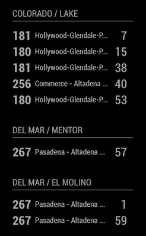

# Module: Pasadena Transit

This [MagicMirror][mm] module shows real-time departures of [LA Metro][lametro] buses. 
Magic Mirror module for LA Metro. Real-time LA Metro departures.

The module is designed to pull the estimated time of arrival of the bus based on the stop codes provided in the config file. 
Multiple stops can also be added by adding multiple MMM-LAMetro blocks in the config file

Please note that LA Metro API only currently provides ETA for LA Metro bus and
not other local agencies in LA Area.

For example, if you need ETA for Pasadena Transit, please see a separate module
[MMM-PasadenaTransit](githubPasadena)



## Installation

Go to your MagicMirror's Module directory: 
```bash
cd ~/MagicMirror/modules
```
Clone this repository:
```bash
git clone https://github.com/pbuabthong/MMM-LAMetro.git
```
Install npm packages:
```bash
cd MMM-LAMetro
node install
```

## Using the module

First, add the following to the modules array in the `config/config.js` file: 
```js
modules: [
    {
        module: 'MMM-LAMetro',
        position: 'top_right', // This can be any of the regions.
        config: {
            stopCode: [your stop code #1],
        }
    }, 
    {
        module: 'MMM-LAMetro',
        position: 'top_right', // This can be any of the regions.
        config: {
            stopCode: [your stop code #2],
        }
    }
]
```

## Stop code
The stop codes can be looked up either via Google Maps or [https://www.metro.net/riding/nextrip/bus-stop-number/][stoplookup]

Note that currently, the stops on the opposite side of the street have different stop number. 
If you want the modules to show buses from both direction, please create another config 
with the stop number of the opposite stop

### Example
The following shows an example config file for showing the ETAs of buses from both directions 
at the intersection of Lake Ave & San Pasqual St and another stop on Del Mar
Blvd. and El Molino Ave.
```js
modules: [
    {
        module: "MMM-LAMetro",
        position: "bottom_left",
        config: {
            stopCode: 13681,
            header: 'North of apartment
            updateTime: 60000, 
        },
    },
    {
        module: "MMM-LAMetro",
        position: "bottom_left",
        config: {
            stopCode: 5234,
            updateTime: 30000, 
        },
    },
    {
        module: "MMM-LAMetro",
        position: "bottom_left",
        config: {
            stopCode: 1378,
            maxNumETA: 5,
        },
    },
]
```

## Configuration options
Option|Description
------|-----------
`stopCode`|Stop Number [See here][stoplookup] A.<br/>**Expected Value type:** `int`.
`maxNumETA`|Maximum number of ETAs to be shown.<br/>**Expected Value type:** `int`.
`maxNameLength`|Maximum length of the stop name .<br/>**Expected Value type:** `int`.
`header`|Header of the module block (optional: default to the name of the bus stop).<br/>**Expected Value type:** `string`.
`updateInterval`|Time between updates, in seconds. To protect API abuse, this module automatically limits this value to a minimum of `10`.<br/>**Expected Value type:** `int`.

## Planned Features
- [x] Support multiple stops

[mm]: https://github.com/MichMich/MagicMirror
[githubPasadena]: https://github.com/pbuabthong/MMM-PasadenaTransit
[lametro]: https://www.metro.net/
[stoplookup]: https://www.metro.net/riding/nextrip/bus-stop-number/
